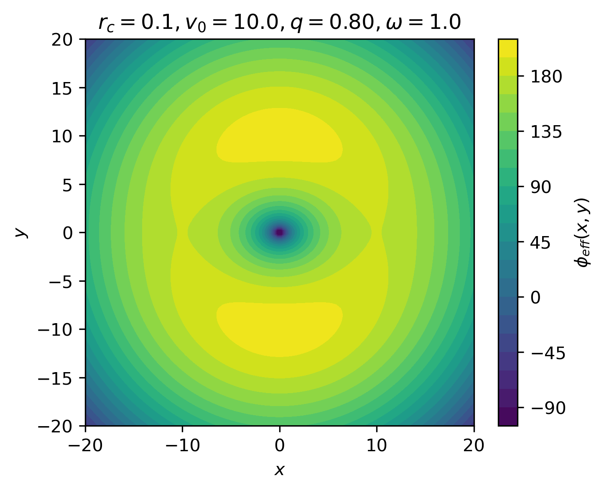

Getting Started
===============
Definitions
-----------
The module is used to do computations and visualizations of a 4D phase-space in a *reduced* 2D phase space.
This typically means that one variable is eliminated via an integral of motion and another is "eliminated"
by viewing only a slice of the phase space where it is equal to 0. The simplest example is a cartesian system
with conserved energy: one velocity (e.g. :math:`\dot{y}`) can be eliminated through the Hamiltonian integral
and, by considering only the slice :math:`y=0`, the reduced phase space is :math:`S = \{x,\dot{x}\}`.
Any point in :math:`S` can then be used as an initial condition to integrate an orbit in some potential that lives
in the full 4D phase space, since the 2 missing variables can be deduced from the 2 given ones.

A *Poincaré map* is an application that takes a point in :math:`S` space and maps it to another,
by integrating an orbit with ICs given by the starting point until it crosses the map plane (:math:`y=0` above) again
in some predefined direction, typically from the positive one (:math:`y>0`).

.. figure:: https://upload.wikimedia.org/wikipedia/commons/8/84/Poincare_map.svg
  :width: 300
  :alt: Illustration of a Poincaré Map

  Illustration of a Poincaré Map. Credit: Gato ocioso (Wikimedia)

To be general, one considers a map of *order N*, meaning that the mapped point is the one after *N* crossings have occured.

A *Poincaré Section* of order *N* is an ensemble of maps for a range of starting points in *S*, where all points up to order *N*
are kept. The set of points for a given starting point is called *orbit* in the following.
Implicitely, one Poincaré Section corresponds to a specific energy, for the reasons explained in the first paragraph.

Finally, at a fixed energy *E*, there is in general only a finite region of the phase space, and thus also of :math:`S`
accessible to an orbit because of the condition :math:`E = \phi + K > 0`, where :math:`K` is the kinetic energy. This region
is bounded by the so-called *zero-velocity curve* (ZVC), which thus gives the contour of the Poincaré section.

Module Usage
------------
All computations are handled by the :ref:`PoincareMapper <poincaremapper>` class, which takes as main argument a
physical potential describing the dynamics within the phase space, given in the form of a :ref:`Potential <potentials>` object.

The mapper object can be used to do many things, see its API description for the details on how to use it.
In particular, its ``section()`` method computes a Poincaré section at some energy *E* as described above, by
automatically finding the zero-velocity curve at this energy and considering a number *N_orbits* of starting points lying
uniformly on the *x* axis (when thinking in cartesian coordinates). The computed maps are of order *N_points*,
since this is the number of points that will be displayed *per* orbit when visualizing the results. The method also outputs
the corresponding configuration-space orbits, as well as the calculated ZVC.

The ``sectioncollection()`` method goes one step further and essentially computes a *section* for each of a given
range of energies.

Once one has a set of Poincaré sections at different energies, as well as the associated orbits and ZVCs, the
:ref:`Tomography <tomography>` class can be used to visualize them.

Examples
--------
A set of example scripts can be found in the ``examples`` directory at the root of the repository. These examples
showcase how one can definine a potential, use the ``PoincareMapper`` class to do computations, visualize the results
and export/import the computation results for later reuse.

1. Rotating Logarithmic Potential (For Astro III)
^^^^^^^^^^^^^^^^^^^^^^^^^^^^^^^^^^^^^^^^^^^^^^^^^
The script ``examples/rotating_log.py`` considers the case of a logarithmic potential:

:math:`\phi(x,y) = \frac{1}{2}v_0^2 \log{\left(r_c^2 + x^2 + \frac{y^2}{q^2}\right)}`

which is rotating with angular velocity :math:`\omega`. As shown in the lecture, the rotation induces an
effective potential

:math:`\phi_{eff}(x,y) = \phi(x,y) - \frac{1}{2} \omega^2 (x^2 + y^2)`,

as well as coriolis and centrifugal terms in the Hamilton equations.

Customization
=============

Implementing a new potential
----------------------------

Page in development.